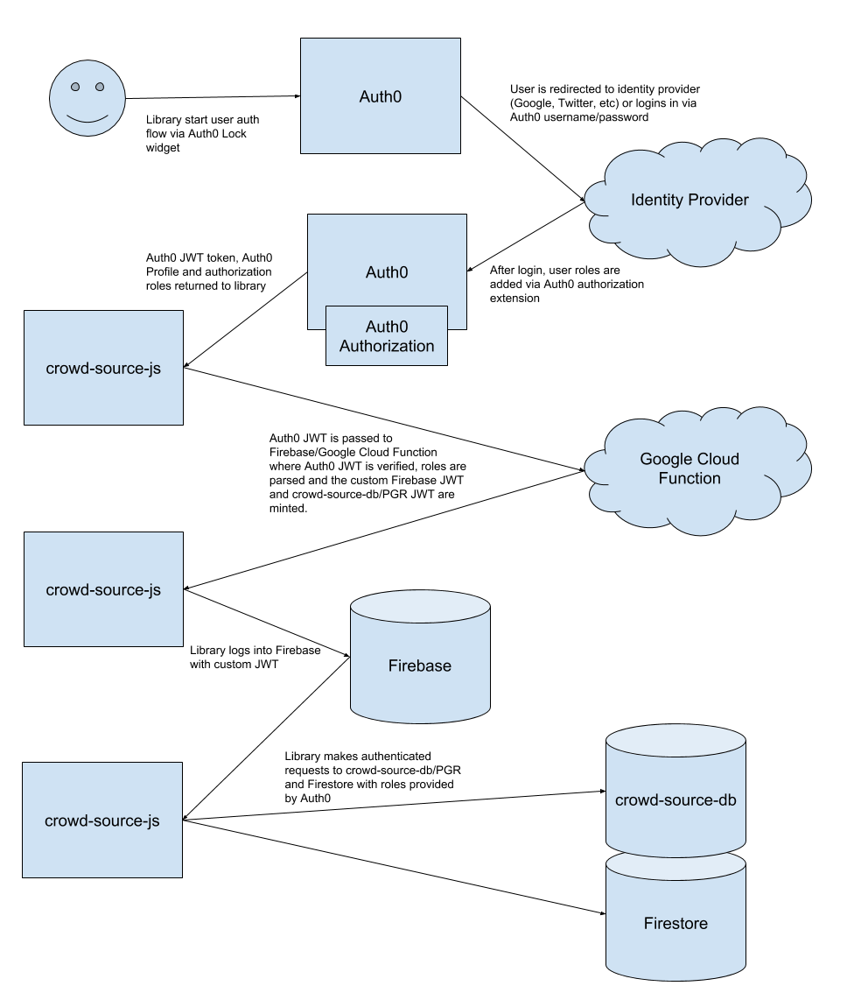

# crowd-source-js
JS library for interacting with UCD library crowd source databases.  Including crowd-source-db (PGR/Postgres), Firestore and UCD FIN/DAMS

# Overview


# Method Overview

## Crowd Inputs
- get approved by item (PGR)
  - gets all approved inputs for item
  - will trigger update events for individual inputs and item
- get approved by id (PGR)
- set approved (PGR/Firestore)
  - add input to pgr, remove from firestore
- add pending (Firestore)
  - add pending input to firestore
- remove pending (Firestore)
  - remove a pending crowd input.  
  - Must be admin or owned by user
- update pending (Firestore)
  - update a pending crowd input.  
  - Must be admin or owned by user
- get pending (Firestore)
- get pending by item (Firestore)
  - get all pending inputs for item
  - will trigger update events for individual inputs and item
- listen pending by item (Firestore)
  - get pushed updates of all inputs for item
  - will trigger update events for individual inputs and item
  - if input is deleted, will check if it was approved.  Fires approved update event if it was 
- unlisten pending by item (Firestores)
  - stop listing to push update of inputs for item

## Items
- get by id (ElasticSearch)
- search (ElasticSearch)
  - supports text, filters, limit, offsets, etc
- get crowd info (PGR)
  - get crowd information for item, ex: editable, completed
- update crowd info (PGR)
  - update the crowd information for item (admin only)
- get crowd child stats (PGR)
  - given a item id, get summary of crowd info for all child items

## Presence

- set user id (Firestore)
  - set the user id to be automatically associated with all presence objects
- update presence (Firestore)
  - add or update a new presence object.  Will automatically add userId, uid
    and appId to object.  Used to listen for realtime updates of user presence.
- remove presence (Firestore)
  - remove a presence object

*Note: the PresenceService will listen to firebase authentication events and remove presence on logout.  The service will also set handlers so on disconnect, presence objects are removed.

## Auth

- userLogin
  - Given a user Firebase jwt token and PGR jwt token, store tokens and run firebase login function.
- anonymousLogin (Google Cloud Function)
  - Use the Google Cloud Function service to generate anonymous user firebase and pgr tokens.  Then login user to firebase with token and finally store tokens

## Auth0

Auth0 is an optional extension for including Auth0 as a authentication and authorization source.  Note the AuthModel just requires JWTs signed with applications Firebase and PGR accounts.  This Auth0Model provides support for; logging in via Auth0 Lock UI, running Auth0 Lock authentication flow, generating Firebase and PGR JWTs from Auth0 JWT.  The generated JWTs are then passed to the AuthModel userLogin() function.

Note.  Perhaps this should be broken out to it's own JS library?

- login (Auth0 Lock)
  - Show the Auth0 Lock widget starting the login flow
- isRedirect 
  - is the current hash in the windows url a redirect from Auth0?  If so, continue the login flow
- loginJwt (Google Cloud Function)
  - Continue Auth0 login flow after new Auth0 JWT is issued.  Given a Auth0 JWT, use the Google Cloud Function service to generate Firebase and PGR JWTs from Auth0 JWT.  Roles provided in Auth0 JWT will be automatically associated to Firebase/PGR JWTs.
- initAuthRenewAuth0/autoRenew (PostMessage Iframe)
  - both of these functions should be called by isRedirect(true).  The true flag will initiate a silent login flow for user if the url hash is not in the middle of a Auth0 login.  Silent logins will take a access token that is about to expire and generate a new one.

# Authentication

## crowd-source-db (PostgREST/PostreSQL)

PostgREST authenticates via a Bearer JWT token in the Authorization header.  Use the AuthModel.userLogin() function to set tokens.  The JWT should have the following payload:

```js
{
  username : '',
  role : ''
}
```

Where role is empty, 'anon', 'editor' or 'admin'.  JWTs can be minted for PGR using the jsonwebtoken library.

```js
const jwt = require('jsonwebtoken');
let token = jwt.sign({username, role}, 'secret');
```

## Firestore

Firebase has several authentication methods but the JWT token method is highly recommended.  The payload for the token should include the following flags:

```js
{
  isAnonymous : false, 
  isAdmin : false
}
```

You should use the firebase-admin library with a Google/Firebase Service Account to mint the tokens.  You should also take care to set the user account custom claims when you mint a token (See /firebase/functions/lib/auth.js _generateFirebaseToken()).  This ensures claims are associated with the acutal user account (Not just the JWT) and are very helpful for using the firebase user management APIs. Once firebase is authenticated with the token, no further action is required.

```js
const admin = require('firebase-admin');
const serviceAccount = require('./service-account.json');

(async function() {
  let userId = 'alice';
  let claim = {
    isAdmin : true
  }

  try {
    let user = (await firebase.auth().getUser(userId)).toJSON();
    if( !deepEqual(claim, user.customClaims) ) {
      await firebase.auth().setCustomUserClaims(userId, claim);
    }
  } catch(e) {
    await firebase.auth().createUser({uid: userId});
    await firebase.auth().setCustomUserClaims(userId, claim);
  }

  await firebase.auth().createCustomToken(userId, claim);
})();
```

## FIN / DAMS

The DAMS Elastic Search API is public and does not require authentication.

# Auth0

Here is the standard authentication flow with Auth0

