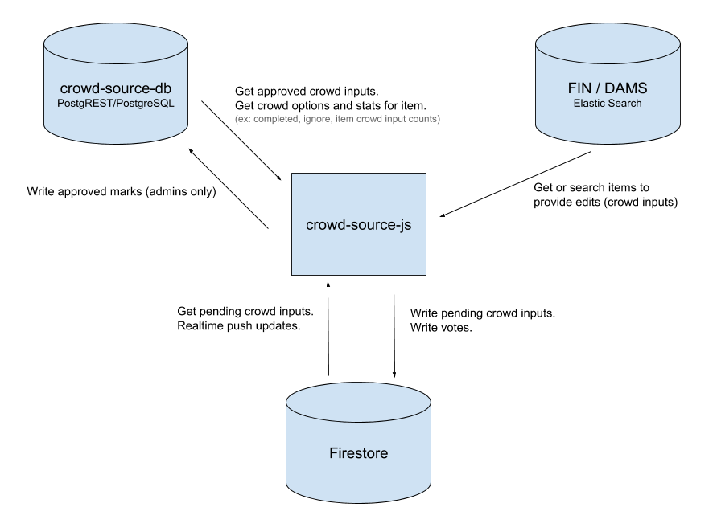

# crowd-source-js
JS library for interacting with UCD library crowd source databases.  Including crowd-source-db (PGR/Postgres), Firestore and UCD FIN/DAMS

# Overview



# Method Overview

## Crowd Inputs
- get approved by item (PGR)
  - gets all approved inputs for item
  - will trigger update events for individual inputs and item
- get approved by id (PGR)
- set approved (PGR/Firestore)
  - add input to pgr, remove from firestore
- add pending (Firestore)
  - add pending input to firestore
- remove pending (Firestore)
  - remove a pending crowd input.  
  - Must be admin or owned by user
- update pending (Firestore)
  - update a pending crowd input.  
  - Must be admin or owned by user
- get pending (Firestore)
- get pending by item (Firestore)
  - get all pending inputs for item
  - will trigger update events for individual inputs and item
- listen pending by item (Firestore)
  - get pushed updates of all inputs for item
  - will trigger update events for individual inputs and item
  - if input is deleted, will check if it was approved.  Fires approved update event if it was 
- unlisten pending by item (Firestores)
  - stop listing to push update of inputs for item

## Items
- get by id (ElasticSearch)
- search (ElasticSearch)
  - supports text, filters, limit, offsets, etc
- get crowd info (PGR)
  - get crowd information for item, ex: editable, completed
- get crowd child stats (PGR)
  - given a item id, get summary of crowd info for all child items

# Authentication

## crowd-source-db (PostgREST/PostreSQL)

PostgREST authenticates via a Bearer JWT token in the Authorization header.  Methods that require authentication (currently the CrowdSourceModel.setApproved() ) require the JWT when called.  The JWT should have the following payload:

```js
{
  username : '',
  role : ''
}
```

Where role is empty or 'admin'.  JWTs can be minted for PGR using the jsonwebtoken library.

```js
const jwt = require('jsonwebtoken');
let token = jwt.sign({username, role}, 'secret');
```

## Firestore

Firebase has several authentication methods but the JWT token method is recommended.  The payload for the token should include the email and isAdmin flag.

```js
{
  email : '', 
  isAdmin : false
}
```

You should use the firebase-admin library with a Google/Firebase Service Account to mint the tokens.  Once firebase is authenticated with the token, no further action is required.

```js
const admin = require('firebase-admin');
const serviceAccount = require('./service-account.json');

(async function() {
  admin.initializeApp({
    credential : admin.credential.cert(serviceAccount)
  });

  let token = await admin.auth().createCustomToken(
    userId,
    {email, isAdmin}
  );
})();
```

## FIN / DAMS

The DAMS Elastic Search API is public and does not require authentication.